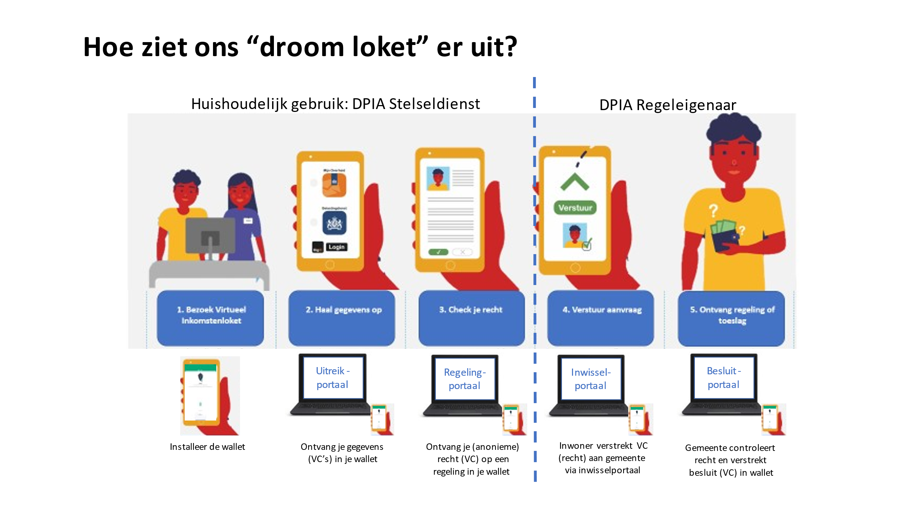

# VIL Documentatie

 Documentatie voor Virtueel Inkomsten Loket

# [Wallet](wallet.md)

Voor het gebruik van het Virtueel Inkomsten Loket (VIL) )is een zogenaamde SSI *wallet* nodig. SSI staat voor Self Sovereign Identity en bevat [standaarden](https://www.w3.org/TR/vc-data-model/ "W3C DID en Verifiable Credentials") voor het uitwisselen van gegevens met behoud van privacy. De wallet is een App voor op je telefoon en kan je downloaden vanuit de Appstore (voor [iPhone](https://apps.apple.com/sa/app/sovrhd/id1571101544 "SSI wallet")) of de Google Play Store (voor [Android phone](https://play.google.com/store/apps/details?id=com.ovrhd.sovrhd "sovrhd app"))

# Ontwerp

Het VIL bevat inkomensafhankelijke overheidsregelingen waarbij je zelf kan beoordelen of je voor een regeling in aanmerking komt, door het verzamelen van betrouwbare gegevens in je wallet en die vervolgens tegen de voorwaarden van de regeling aan te houden. Het VIL bestaat concreet uit de wallet en 4 digitale portalen:

1. Wallet
2. Uitreikportaal
3. Regelingenportaal
4. Inwisselportaal
5. Consulentenportaal

De klantreis is zodanig dat de portalen in deze volgorde worden doorlopen om uiteindelijk de gevraagde dienst af te kunnen nemen. Het Uitreikportaal (2) bevat functies om bepaalde gegevens in je wallet (1) te laden. Met deze gegevens kan je dan vervolgens in het Regelingenportaal (3) checken of je voor een bepaalde regeling in aanmerking komt. Als dat zo is ontvang je een Voucher in je wallet, die in feite een claim voorstelt op een bepaald recht. Deze Voucher kan je dan inwisselen in het Inwisselportaal (4), waarmee formeel een Aanvraag voor een dienst wordt opgestart. Deze Aanvraag wordt door een ambtenaar (gemeente consulent) beoordeeld in het Consulentenportaal (5) of Besluitportaal op basis van de ingewisselde Voucher, die de uitkomst van de regelingencheck bevat en de oorspronkelijke gegevens waarmee de check is uitgevoerd, dus een check op de voorwaarden van de regeling. Als de ambtenaar een en ander heeft geverifieerd volgt er een Besluit of Beschikking die in de gemeentelijke administratie wordt opgeslagen en als een transactiebewijs ook naar je wallet wordt gestuurd. Dan begint het reguliere proces van de regeling te lopen.

# Verantwoording

Het ontwerp is gebaseerd op het concept van burgerregie, dat programma IGS van SZW sinds 2019 propageert en ook in diverse overheidsprogramma's wordt gehanteerd zoals [Regie op Gegevens](https://www.digitaleoverheid.nl/overzicht-van-alle-onderwerpen/regie-op-gegevens/) en [EDI-wallet](https://edi.pleio.nl/) (BZK), in relatie tot de Europese programma's [eID](https://commission.europa.eu/strategy-and-policy/priorities-2019-2024/europe-fit-digital-age/european-digital-identity_nl) en [EBSI](https://ec.europa.eu/digital-building-blocks/wikis/display/EBSI/Home).

De concrete, technische invulling van het concept is binnen VIL gerealiseerd met een SSI Infrastructuur, waarbij de wallet het uitwisselingsmechanisme is in de vorm van een app op je telefoon. Daarnaast zijn er functies nodig om gegevens van en naar de wallet te laten stromen, om de uitwisseling concreet tot stand te brengen. Al deze functies samen, de governance en de rollen die daarbij horen zijn onderdeel van de [SSI Infrastructuur](ssi.md) en zijn ook nog in ontwikkeling. De complete stelselarchitectuur inclusief governance en rollen is [hier](https://stelsel-architectuur.twi-programma.nl/ "Stelselarchitectuur") te vinden.

# Handleiding

Om het VIL te bedienen en de klantreis te ervaren is het volgende stappenplan van toepassing:

1. Download de SSI wallet app uit de betreffende appstore en volg de instructies op
2. Ga naar het uitreikportaal en laad gegevens in de wallet
3. Ga naar het regelingenportaal en check je recht op regelingen, indien het recht er is ontvang je een Voucher in je wallet
4. Ga naar het inwisselportaal en wissel de Voucher in door het starten van een Aanvraag
5. Zodra de consulent de aanvraag heeft beoordeeld in het consulentenportaal ontvang je een besluit in je wallet en start de uitvoering van de regeling
