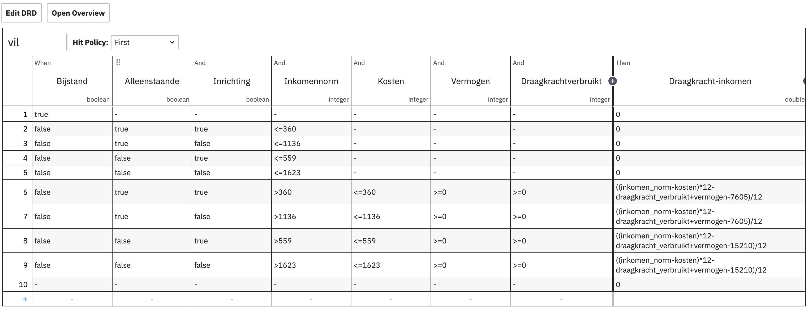
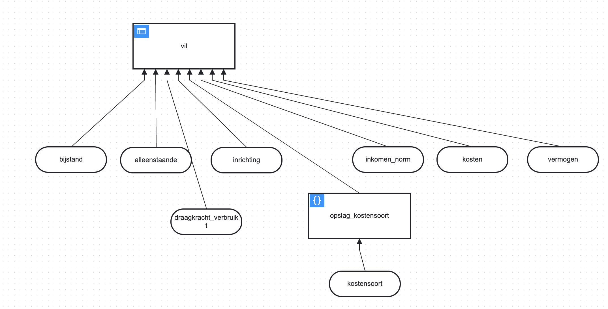

# Draagkracht

De inkomensafhankelijke regeling voor de bijzondere bijstand is een complexe regeling in de zin dat er veel specifieke informatie moet worden gecontroleerd om in aanmerking te komen. Daarbij is er ook een verschil in parameters en soorten uitgaven die worden meegnomen per gemeente.

Een belangrijk aspect van de bijzondere bijstand is de draagkrachtberekening. Hiermee kan worden aangetoond of de aanvrager in principe voldoende draagkracht heeft om de incidentele uitgave, waarvoor hij de aanvraag doet, al dan niet zelf te bekostigen. Hier hangt dus nogal wat van af, dus daarom moeten er zoveel mogelijk uitgaven zo specifiek mogelijk worden opgegeven. De controle daarop is daarom ook direct complex.

## Welke gegevens?

De volgende gegevens uit de wallet zijn nodig:

* huishoudsamenstelling
* leefsituatie (bijstand, inrichting)
* leeftijd
* huurgegevens (optioneel)
* inkomen
* uitgaven in categorieën
* vermogen

Deze gegevens worden gevraagd om en draagkrachtberekening uit te voeren. Omdat er geen directe persoonsgegevens zoals NAW of BSN worden gevraagd kan deze berekening dus anoniem plaatvinden, als ware het een proefberekening maar dan wel met gevalideerde gegevens.

## Hoe komen we tot draagkracht?

1. Informeer bij de gemeente wat de voorwaarden zijn
2. Parametriseer deze voorwaarden in de DMN tabel en zorg voor een versienummer met geldigheidsduur
3. Laat deze testen door een aantal consulenten

## DMN tabel

Voor het digitaal controleren of men in aanmerking komt voor een regeling passen we de zogenaamde [DMN standaard](https://www.omg.org/spec/DMN/1.3/PDF) toe, dat gaat uit van parametriseerbare beslistabellen die door een functioneel beheerder zijn aan te passen en leesbaar overeenkomen met de voorwaarden van een regeling.

Hier een voorbeeld van de draagkracht beslistabel voor Utrecht:

Dit lijkt nog overzichtelijk, maar met name de `Kosten` input zijn voor elke gemeente anders te bepalen, zie hier de DRD van Amersfoort, waar er een oplsag geldt voor het type kostensoort waarvoor bijzondere bijstand wordt gevraagd:

