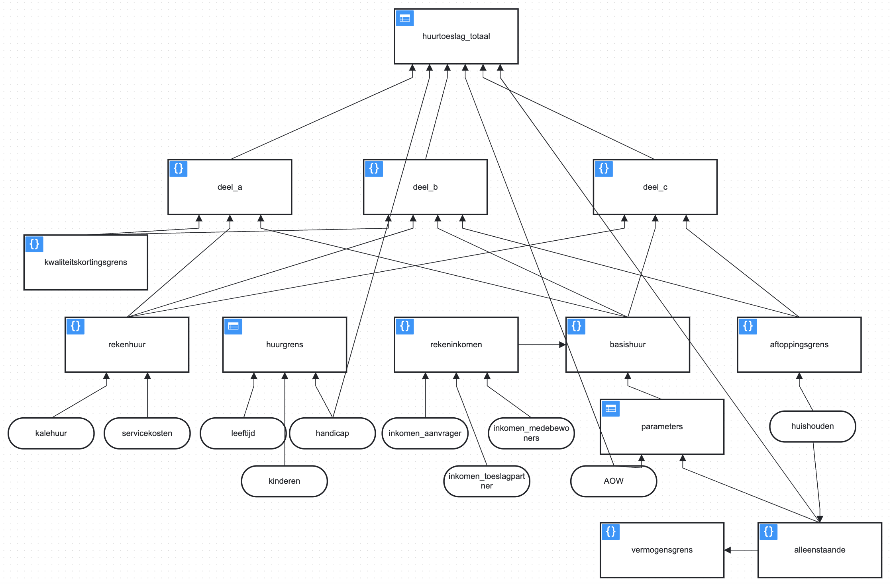

# Huurtoeslag

Een onderdeel van de draagkrachtberekening is de eventueel misgelopen huurtoeslag, dus die moet berekend worden. Vaak zijn dezelfde gegevens nodig van andere inkomensafhankelijke regelingen. 

## Welke gegevens?

De volgende gegevens uit de wallet zijn nodig:

* huishoudsamenstelling
* leefsituatie (handicap)
* leeftijd
* huurgegevens
* inkomen

Deze gegevens worden gevraagd om de huurtoeslag te bepalen. Omdat er geen directe persoonsgegevens zoals NAW of BSN worden gevraagd kan deze berekening dus anoniem plaatvinden, als ware het een proefberekening maar dan wel met gevalideerde gegevens.

## Hoe komen we tot de huurtoeslag?

1. Informeer bij de belastingdienst wat de [voorwaarden](https://download.belastingdienst.nl/toeslagen/docs/berekening_huurtoeslag_tg0831z31fd.pdf) zijn, die verschillen per (half) jaar
2. Parametriseer deze voorwaarden in de DMN tabel en zorg voor een versienummer met geldigheidsduur
3. Laat deze testen door een aantal consulenten

## DMN tabel

Voor het digitaal controleren of men in aanmerking komt voor een regeling passen we de zogenaamde [DMN standaard](https://www.omg.org/spec/DMN/1.3/PDF) toe, dat gaat uit van parametriseerbare beslistabellen die door een functioneel beheerder zijn aan te passen en leesbaar overeenkomen met de voorwaarden van een regeling.

De huurtoeslag wordt via meerdere DMN-tabellen en berekeningen gedaan, uitmondend in een DRD  (Decision Requirements Diagram)

