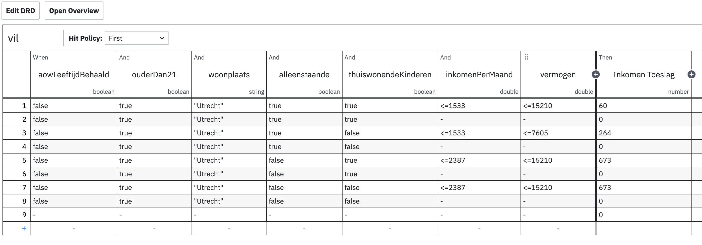
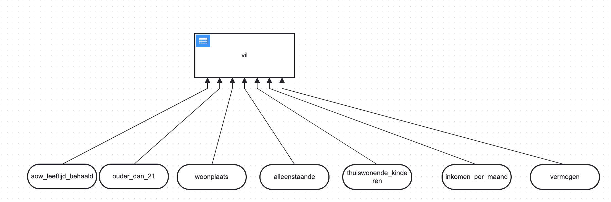

# Individuele Inkomens Toeslag

De Individuele Inkomensafhankelijke Toeslag regeling (IIT) is een relatief eenvoudige regeling voor lagere inkomens. Er zijn een aantal voorwaarden die gecontroleerd moeten worden en gemeenten hanteren een klein verschil in parameters qua inkomensgrenzen.

## Welke gegevens?

De volgende gegevens uit de wallet zijn nodig:

* huishoudsamenstelling
* leeftijd
* woonplaats
* inkomen
* vermogen

Deze gegevens worden gevraagd om tegen de IIT van VIL te checken. Omdat er geen directe persoonsgegevens zoals NAW of BSN worden gevraagd kan deze check dus anoniem plaatvinden, als ware het een proefberekening maar dan wel met gevalideerde gegevens.

## Hoe komen we tot een IIT check?

1. Informeer bij de gemeente wat de voorwaarden zijn
2. Parametriseer deze voorwaarden in de DMN tabel en zorg voor een versienummer met geldigheidsduur
3. Laat deze testen door een aantal consulenten

## DMN tabel

Voor het digitaal controleren of men in aanmerking komt voor een regeling passen we de zogenaamde [DMN standaard](https://www.omg.org/spec/DMN/1.3/PDF) toe, dat gaat uit van parametriseerbare beslistabellen die door een functioneel beheerder zijn aan te passen en leesbaar overeenkomen met de voorwaarden van een regeling.

Hier een voorbeeld van de IIT beslistabel voor Utrecht:

Op een hoger niveau zien we een DRD, een Decision Requirements Diagram, dat weergeeft welke gegevens als input dienen voor de beslistabel, waarbij er ook sub-beslistabellen kunnen zijn, voor complexere regelingen:

