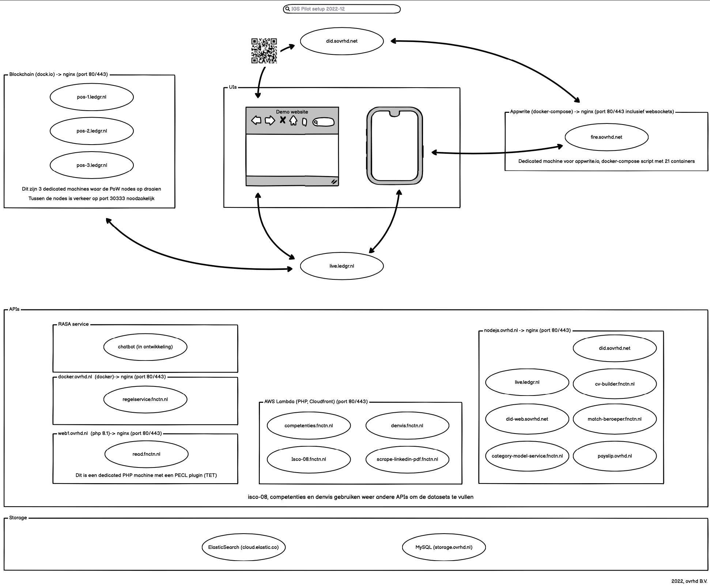
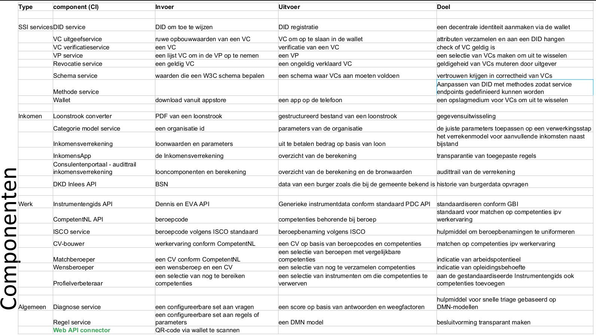

# Technisch Ontwerp

De techniek achter VIL bestaat voor een groot deel uit de [SSI Infrastructuur](/ssi.md) en een aantal functies daaromheen, waarbij de interactie tussen de wallet en de 4 portalen centraal staat en ook het meest complex is. Onderstaand is een overzicht van het technische landschap.

De bovenste helft van het plaatje geeft het beste de kernarchitectuur van VIL weer:

* links de blockchain gebaseerd op de open source [dock.io]() SDK waar de DIDs en de Verifiable Credentials worden weggeschreven en gevalideerd, bestaande uit 3 (synchroniserende) machines
* in het midden de wallet en de portalen die communiceren met [live.ledgr.nl](live.ledgr.nl/docs), dat is een API machine om te kunnen communiceren met de blockchain
* rechts de link naar de [Appwrite](appwrite.io) machine, [fire.sovrhd.net](), dat is een open source *backend-as-a-service*, vergelijkbaar met [Google Firebase](https://firebase.google.com/), voor de communicatie tussen de wallet en de portalen

De onderste helft bestaat uit een aantal "hulpdiensten", vooral APIs die 

* QR-codes genereren en VCs uitgeven ([did.sovrhd.net](did.sovrhd.net/api "QR-codes"))
* in het Regelingenportaal worden gebruikt om voorwaarden te kunnen checken met gegevens ([regelservice.fnctn.nl](regelservice.fnctn.nl/docs "Regelservice"))
* in eerdere PoCs en pilots zijn gebruikt
  * chatbot (RASA-service), te integreren in [GEM](https://opengem.nl/producten/chatbot/)
  * AWS lambda functies voor het Werkdomein (middelste blok en [match-beroeper.fnctn.nl](match-beroeper.fnctn.nl/api))
  * functies voor het Inkomendomein voor de Bijstand ([category-model-service.fnctn.nl](category-model-service.fnctn.nl/api))

## Beknopt overzicht

## Modellen

Er is een aantal [C4 modellen](https://stelsel-architectuur.twi-programma.nl/376b5005-25b5-42f8-9d42-f871d91dd242/views/id-fe2159a8f14d4015a34210d3585ac309.htm "C4 model van VIL") gemaakt van de pilots, die geven in het algemeen een consistent beeld van de opbouw van een pilot.

## Repositories (codebestanden)

Toegang tot de code kan worden gegeven via [GitLab](https://gitlab.com/ovrhd/igs)
