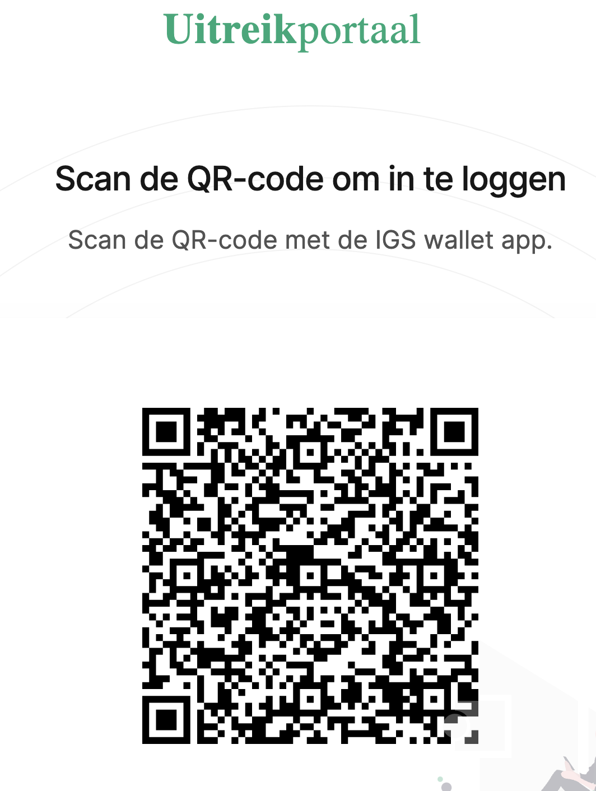
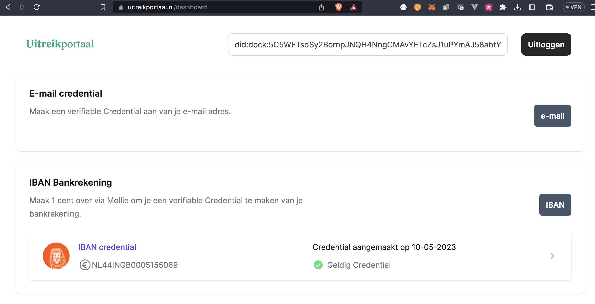
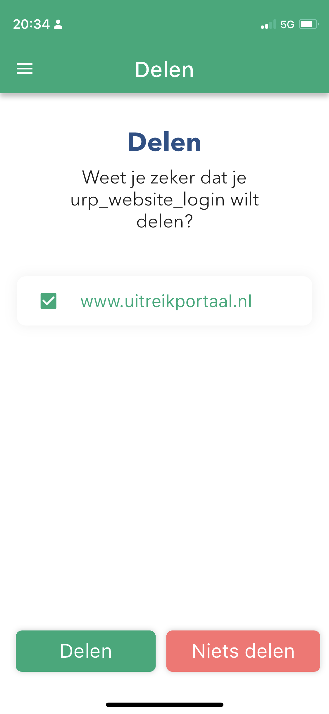

# Uitreikportaal

Dit is het eerste van de 4 loketten die tezamen het VIL vormen. De [wallet](/wallet.md "SSI Wallet") is het verbindende concept tussen deze loketten. Waarom 4 loketten? Om privacy te beschermen en wettelijke grondslagen te respecteren passen we deze ontkoppeling van loketten toe. Dit zorgt er voor dat een burger meerdere opties heeft om met zijn gegevens zijn situatie te verbeteren. In het burgerregie stramien van "Overzicht, Inzicht en Hergebruik" is met name het Hergebruik hier van toepassing.

Het uitreikportaal zorgt ervoor dat er belangrijke persoonlijke gegevens in de wallet worden geladen, waarbij de betrouwbaarheid en actualiteit door de afzender of **uitreiker** van het gegeven worden bepaald, een belangrijk aspect van SSI. Voor meer inzicht in hoe een en ander ander technisch is gebouwd, zie het [technisch ontwerp](techniek.md).

## Welke gegevens?

Op dit moment kunnen voor VIL de volgende gegevens via het uitreikportaal in de wallet worden geladen:

* website inlog bewijs
* email adres
* bankrekening
* mijnoverheid gegevens
* banktransacties, gecategoriseerd naar NIBUD

Deze gegevens zijn in principe voldoende om tegen de inkomensafhankelijke regelingen van VIL te checken.

## Hoe kom ik daar?

1. Download de wallet uit de betreffende appstore
2. Ga naar [uitreikportaal.nl](https://uitreikportaal.nl) en ga naar `Registreren`

   Hierna verschijnt een QR-code om te scannen met de wallet

vervolgens krijg je toegang tot een scherm vergelijkbaar met onderstaande plaat

en je krijgt een VC van een *secret*, het website inlog bewijs, die je kan gebruiken om weer in te loggen, want dan vraagt de website uitreikportaal.nl je om dit te delen zoals hier

3. Volg de knoppen op de website om meer VCs in je wallet te laden
4. Voor sommige VCs (iWize) zal je een eerder verkregen VC (bankrekening) moeten delen om de juiste persoonsgegevens te kunnen laden. Dit is onderdeel van de SSI filosofie en de beveiliging
